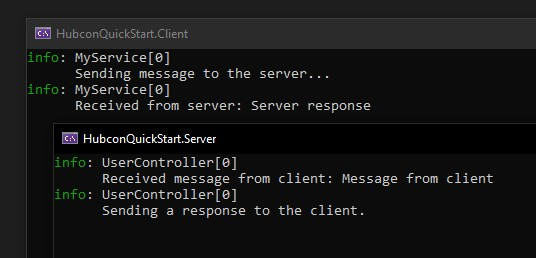
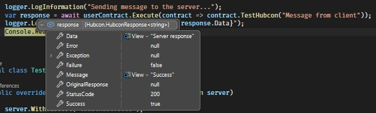

# Hubcon

Use C# interfaces as multi-transport API contracts.
Create an interface, implement on server, use in client.

Hubcon is high-performance, near zero-alloc RPC framework for .NET where interfaces define contracts, 
combining transport-agnostic architecture, a production-grade middleware pipeline, and developer-first design.

Hubcon enables you, as a developer, to very easily implement strongly-typed and fast communications between clients and
servers through HTTP and/or Websockets by just injecting your own interfaces anywhere you need.

## 🚀 Key Features

- **Contract-Based Architecture**: Share interfaces between client and server - implement on server as Controllers/ContractHandlers, use
  directly on client.
- **Transport Agnostic**: Easy multi-transport support. Integrated HTTP and WebSockets, add your own transport.
- **Non-Hubcon REST HTTP Support**: Integrate to any REST-compliant API using interfaces and attributes.
- **Bidirectional Data Streaming**: Send multiple data streams to your server on a single
  call, or stream contents from your server by using `IAsyncEnumerable<T>`.
- **Dependency Injection**: Full DI support for contracts on both client and server.
- **Custom Middlewares**: Lightweight custom ASP.NET-like middlewares with an extended operation context featuring all the pre-processed data about your operation, with full DI support.
- **Plug & Play**: Minimalistic configuration setup, extensive customization options.
- **High Performance**: Optimized for high throughput, high concurrency stability and low latency.
- **Integrated Rate Limiting**: Built-in throttling to prevent overload and ensure fair resource usage, in both client and server.
- **Optional remote cancellation**: Client-side tokens can optionally cancel local and remote operations using simple
  cancellation tokens.
- **Memory Optimized**: Made to sustain a very high throughput with minimal memory footprint. Leak-free, minimal alloc
  architecture, confirmed by over 5 billion requests tests.
- **OpenAPI**: Compatibility with OpenAPI.
- **Working examples**: This project includes a classic Client + Server example used as test-bench and benchmark, a
  BlazorWasm + Server example and a triple microservice loop example.

## 🏗️ Quick Start

### Prerequisites
For this, we need to create 3 projects:


1. A client project, we are using a console app for this example. Requires .NET 5+.
2. A server project, we are using ASP.NET Core Web API for this example. Requires .NET 8+.
3. A shared project to define your contracts.

We will be using NET 8 as a target in all 3 projects for this example and top-level statements for simplicity.

We will explain the important components later.

### 1. Installation
Next, we install the unified `Hubcon` nuget package on all projects. It will automatically adapt to the project type.

```
dotnet add package Hubcon
```
Note that ASP.NET Core 8 API uses an older Swashbuckle nuget package version for OpenAPI that conflicts with Hubcon as it uses a newer version. 
You can remove it safely as it's not needed.

You can also install `Hubcon.Client`, `Hubcon.Server` and `Hubcon.Shared` individually, that's up to you.

### 2. 📜 Define Your Contract

A contract is any C# interface that inherits from `IControllerContract`.
Put this in your shared project, which will be used by both client and server.

```csharp
using Hubcon;

[HttpTransport]
public interface IUserContract : IControllerContract
{
    Task<string> TestHubcon(string message);
}
```
### 3. 💻 Client configuration
In program.cs:
```csharp
using Hubcon;
using HubconQuickStart.Shared;
using Microsoft.Extensions.DependencyInjection;
using Microsoft.Extensions.Hosting;
using Microsoft.Extensions.Logging;

var builder = Host.CreateApplicationBuilder(args);

Console.Title = "HubconQuickStart.Client";

// We add the hubcon client services
builder.Services.AddHubconClient();

// We register the remote server module
builder.Services.AddRemoteServerModule<TestRemoteServerModule>();

// We add some testing service
builder.Services.AddSingleton<MyService>();

var app = builder.Build();

// We simulate a service being used
var userContract = app.Services.GetRequiredService<MyService>();
await userContract.DoSomething();

internal class MyService(IUserContract userContract, ILogger<MyService> logger)
{
    public async Task DoSomething()
    {
        logger.LogInformation("Sending message to the server...");
        var response = await userContract.Execute(contract => contract.TestHubcon("Message from client"));
        logger.LogInformation($"Received from server: {response.Data}");
        Console.ReadKey();
    }
}

internal class TestRemoteServerModule : RemoteServerModule
{
    public override void Configure(IServerModuleConfiguration server)
    {
        server.WithBaseUrl("localhost:5000");
        server.UseInsecureConnection(); // For testing purposes only

        server.Implements<IUserContract>();
    }
}
```

### 4. 🌐 Server configuration
In program.cs:
```csharp
using Hubcon;
using HubconQuickStart.Shared;

var builder = WebApplication.CreateBuilder(args);

Console.Title = "HubconQuickStart.Server";

// We add the hubcon server services
builder.AddHubconServer(x =>
{
    x.AutoRegisterControllers();
});

var app = builder.Build();

// Maps hubcon operations to HTTP
app.UseHubconHttpEndpoints();

await app.RunAsync("http://localhost:5000");

internal class UserController(ILogger<UserController> logger) : IUserContract
{
    public async Task<string> TestHubcon(string message)
    {
        Console.Clear();
        logger.LogInformation($"Received message from client: {message}");
        logger.LogInformation($"Sending a response to the client.");
        return "Server response";
    }
}
```

### 5. Running the projects

When running both projects together, both consoles should print:


Congratulations! You called a Hubcon endpoint from a client, using your own interface.

#### ⚡ Some notes
When calling a method, it's optional but **recommended** to use the `Execute` method for contracts, as it returns a `HubconResponse<T>`.
In addition, you can also return `HubconResponse<T>` in your endpoint to customize the response and 
it will automatically be mapped.

```csharp
var response = await userContract.Execute(contract => contract.TestHubcon("Message from client"));
```



The `Execute` method also **catches exceptions** and maps it to the hubcon response.

## 🛠️ Important basic configuration points
Here we will cover the basic configuration points that hubcon exposes in order to work properly for production.

### ⚡ The contract
Hubcon uses C# interfaces as contracts, which means that ANY client that has the contract can directly use ANY server implementing it. 
Hubcon utilizes it as a single source of truth at both sides.

Inherit from the `IControllerContract` interface to make a contract.

### ⚙️ The remote server module
```csharp
internal class TestRemoteServerModule : RemoteServerModule
{
    public override void Configure(IServerModuleConfiguration server)
    {
        server.WithBaseUrl("localhost:5000");
        server.UseInsecureConnection(); // For testing purposes only

        server.Implements<IUserContract>();
    }
}
```

The `RemoteServerModule` is a configuration class that represents a single (remote) server that allows the hubcon client to `Implement` a contract.
A `RemoteServerModule` can implement multiple interfaces, and they will all share the same configurations and transports. 
It also allows to configure `rate limits` (yes, client-side rate limits), request `interceptors`, request `hooks`,  setup `static headers` and `header providers` and even 
access the `HttpClient` and `WebSocketClientOptions` if you need.

For auth flows, the abstract class `BaseAuthenticationManager` should be implemented and registered in the `RemoteServerModule` class.

Note that a contract can only be implemented by one `RemoteServerModule`.

### Hubcon Controllers/ContractHandlers

```csharp
internal class UserController : IUserContract
{
    public async Task<string> TestHubcon(string text)
    {
        Console.WriteLine($"Received message from client: {text}");
        Console.WriteLine($"Sending a response to the client.");
        return "Server response";
    }
}
```
Hubcon Controllers are similar to ASP.NET's traditional controllers in usage, combined with a lightweight pipeline.
The used contract methods in the client will call the corresponding endpoint in the server, through the hubcon middleware pipeline, 
applying rate limits, auth, telemetry, along with your custom middlewares.

Both Controllers and Contracts allow the following attributes:
- `[Authorize]`
- `[Anonymous]`
- `[RateLimit(...)]`
- `[UseApiKey]`
- `[UseJwt]`
- `[HttpTransport]`
- `[WebSocketTransport]`
- `[UseMiddleware<TMiddleware>]`
- OpenAPI configuration attributes

All these attributes can also be used at the endpoint level which have a higher priority, with the exception of `[Authorize]` and `[UseMiddleware<TMiddleware>]` which are accumulative.

## ⚙️ Supported Operations

### ⚡ Round-trip Operations (Invoke)

Round-trip operations are the most common way to call methods on the server and get a response back.

```csharp
public class UserController: IUserContract
{
    public async Task<string> GetUserNameAsync(int id)
    {
        await Task.Delay(100); // Simulate some work
        Console.WriteLine($"User {id} requested.");
        return "HubconUser";
    }
}
```

### ⚡ No Return Operations (Call)

Call operations are one-way calls that do not expect a response from the server.

```csharp
public interface IUserContract : IControllerContract
{
    // Some method that takes multiple parameters and has no return.
    Task SendMessage(int id, string message);
}
```

### ⚡ Streaming methods

Streaming methods allow the server to push a continuous stream of data to the client.
They are supported over HTTP using SSE protocol and WebSockets.

The only requirement is that the method must return an `IAsyncEnumerable<T>`. 

After that, hubcon will do the rest.

```csharp
public interface IUserContract : IControllerContract
{
    public IAsyncEnumerable<string> GetMessages(int count);
}
```

```csharp
public class UserContractHandler(ILogger<UserContractHandler> logger) : IUserContract
{
    public async IAsyncEnumerable<string> GetMessages(int count)
    {
        for (int i = 0; i < count; i++)
        {
            yield return "hello";
        }
    }
}
```

Because servers are too powerful compared to clients, they can be rate limited using the `[RateLimit]` attribute. The framework will do the rest.

The client can use `await foreach` to consume the stream:

```csharp
var messages = client.GetMessages(10);
await foreach (var message in messages)
{
    Console.WriteLine(message); // Should print "hello" 10 times
}
```

Note that if the client disconnects, both the client and the server will automatically cancel the stream.
Streaming methods are not automatically restored on reconnection and will finish gracefully when the server endpoint finishes.

### ⚡ Ingest Methods

Ingest methods allow the client to send one or more streams of data to the server.
Just add an `IAsyncEnumerable<T>` parameter to your endpoint and Hubcon will handle the rest.

Ingest methods can be used to send large amounts of data to the server, such as logs, telemetry, or any other data that
needs to be processed in real-time.

```csharp
public interface IUserContract : IControllerContract
{
    /// No return
    Task IngestMessages(IAsyncEnumerable<string> source, CancellationToken cancellationToken = default);

    // Allows return, just like a normal method.
    Task<bool> IngestMessages(IAsyncEnumerable<string> source, CancellationToken cancellationToken = default);
}
```

Some notes:
Ingest methods can be rate limited to prevent overload, and they support cancellation tokens for resource cleaning.

Ingest methods are not automatically re-subscribed on reconnection, and they will be cancelled and cleaned from the server if the connection is lost.
In that case, ingest must be restarted from the client.

- Important: Clients can also rate limit themselves to sync with the server's rate to prevent flooding, which is important
as the anti-flooding and anti-abuse measures are very aggressive by design on a per-client basis.

This will be discussed in the later sections.

## ⚙️Key Configuration Attributes
Hubcon allows using attributes to easily configure client/server interaction.

### 🛠️ Transport Attributes
Transport attributes tell the server which transports an endpoint should be exposed to. If there's one, it will only use one. 
If there are multiple, it will be exposed in multiple transport layers.

Recommended to be used in interfaces at the contract or method level as it allows the client to adapt automatically.

### 🛠️ `[HttpTransport]`
Tells Hubcon that a contract or endpoint needs to be exposed as an HTTP endpoint (including OpenAPI).

```csharp
[HttpTransport] // All methods will use HTTP and clients will also adapt.
public interface IMyContract : IControllerContract
{
    public Task MyMethod();
}
```

or 

```csharp
public interface IMyContract : IControllerContract
{
    [HttpTransport] // Only this method will be exposed as an HTTP endpoint. Overrides contract's transports.
    public Task MyMethod();
}
```

### 🛠️ `[WebSocketTransport]`
Tells Hubcon to use the framework's WebSocket implementation. Note that WebSockets **require authorization by default**.

```csharp
  [WebSocketTransport] // All methods will use HTTP and clients will also adapt.
  public interface IMyContract : IControllerContract
  {
    public Task MyWebSocketMethod();
    
    [HttpTransport] // This overrides WebSocketTransport. More specific attributes have more priority.
    public Task MyHttpMethod();
  }
```

### 🛠️ `[NonHubconHttpTransport]`
This is a special transport layer specially made to make a contract capable of 
standard RESTful/external/non-hubcon integrations, and enables some additional configuration attributes to achieve this.

To make it simple, this is an OpenAI integration example to their responses API:

```csharp
[NonHubconHttpTransport]
[Header("Authorization")]
public interface IOpenAIContract : IControllerContract
{
    [HttpPost("/v1/responses")] 
    public Task<OpenAIResponse> CreateModelResponse([AsBody] CreateResponseCommand command);
    
    [HttpGet("/v1/responses/{id}")]
    public Task<OpenAIResponse> GetModelResponse(string id);
    
    [HttpGet("/v1/responses/{id}/input_items")]
    public Task<OpenAIList<OpenAIMessage>> GetModelResponseInputs(string id);
    
    [HttpDelete("/v1/responses/{id}")]
    public Task<OpenAIResponse> DeleteModelResponse(string id);
    
    [HttpPost("/v1/responses")]
    [ParseSseMessage("data:")]
    [ParseSseMessage("event:", "event")]
    [ParseEndSseMessage("[DONE]")]
    public IAsyncEnumerable<OpenAIStreamEvent> GetResponseStream([AsBody] OpenAIStreamRequest request);
}
```

then, we implement it in a RemoteServerModule:

```csharp
public sealed class OpenAIServerModule : RemoteServerModule
{
    private readonly IConfigurationRoot config;

    public OpenAIServerModule(IConfigurationRoot config)
    {
        this.config = config;
    }

    public override void Configure(IServerModuleConfiguration server)
    {
        server.WithBaseUrl("https://api.openai.com/");
        
        server.AddHeaderProvider("Authorization", x => "Bearer " + config["OpenAI:ApiKey"]);

        server.Implements<IOpenAIContract>();
    }
}
...
// In program.cs

builder.Services.AddHubconClient()
                .AddRemoteServerModule(() => new OpenAIServerModule(config));
```

Now you can simply call any of the methods, and the underlying implementation will create a standard RESTful request 
for this external/non-hubcon server. A more complete example is provided in the Classic example in this
repository, including classes used.

### 🛠️ Supported HTTP Verb Attributes

Non-Hubcon transport allows the following HTTP verbs:
- `[HttpGet]`
- `[HttpPost]`
- `[HttpPut]`
- `[HttpDelete]`
- `[HttpPatch]`
- `[HttpHead]`
- `[HttpOptions]`

### 🛠️ Path parameter attribute
The framework supports path parameters directly mapped from parameters.

```csharp
public interface IOpenAIContract : IControllerContract
{
    [HttpGet("/v1/responses/{id}")] // Maps from 'id' parameter
    public Task<OpenAIResponse> GetModelResponse(string id);
}
```
### 🛠️ Body parameter attribute

You can modify the request with the `[AsBody]` attribute in parameters. Only allows one complex parameter for the 
whole body.

```csharp
public interface IOpenAIContract : IControllerContract
{
    [HttpPost("/v1/responses")] 
    public Task<OpenAIResponse> CreateModelResponse([AsBody] CreateResponseCommand command);
}
```

### 🛠️ Query parameter attribute

You can deconstruct a complex type into query parameters using `[AsQuery]`

```csharp
public interface IOpenAIContract : IControllerContract
{
    [HttpPost("/v1/responses")] 
    public Task<OpenAIResponse> CreateModelResponse([AsQuery] ExampleCreateResponseCommand command);
}
```

### 🛠️ Static and dynamic header attribute

Hubcon offers two ways to include headers to a request: Static headers, and header providers with DI support.
This also works for `[HttpTransport]` and `[WebSocketTransport]`.
```csharp
[Header("Origin", "my.origin.com")] // Static key-value header
[Header("Authorization")] // Hubcon will use the header provider corresponding to this key,    
                          // registered in the RemoteServerModule that implements this Contract.
public interface IOpenAIContract : IControllerContract {}
```

### 🛠️ SSE Streaming attributes

This transport also allows adapting to Server-Sent Events (SSE) and filtering 
only the messages you want by returning `IAsyncEnumerable<T>` and using some special attributes. 

```csharp
public interface IOpenAIContract : IControllerContract
{
    [HttpPost("/v1/responses")]
    // Tells hubcon to parse SSE messages starting with "data:"
    // Maps to the OpenAIStreamEvent object as a whole
    [ParseSseMessage("data:")]
    // Tells hubcon to parse SSE messages starting with "event:", and maps 
    // them to the "event" property only (case insensitive)
    [ParseSseMessage("event:", "event")]
    // Tells hubcon that if a [DONE] message is received, the stream should be considered as gracefully finished.
    [ParseEndSseMessage("[DONE]")]
    public IAsyncEnumerable<OpenAIStreamEvent> GetResponseStream([AsBody] OpenAIStreamRequest request);
}
```
### 🛠️`[RateLimit]`
This is a special attribute containing multiple configurations to rate limit endpoints, streams and ingest methods.
It will apply rate limits by IP using an internal memory cache with a 15 minute window, keeping the server clean and secure.

When using it in the contract/your interface, the client will also rate limit itself, syncing limits with the server.
Both client and server use bucket rate limiters by default.

You can apply them manually per-contract or per-endpoint, and use global and per-operation-type limiters both in the server
configuration and the RemoteServerModule in client.

The framework also allows to manually register rate limiting to the HTTP transport, which use ASP.NET's limiters.

### 🛠️ Enum Handling Attributes

To finish, we will talk about the Enums support. Enums are known to be tricky when parsing/mapping them from external 
sources, making them difficult to work with and tend to break integrations pretty easily.

Because of this, Hubcon handles them carefully using defaults and fallbacks when parsing them. 
This is an example usage for OpenAI events:

```csharp
public enum OpenAIEventType
{
    [JsonPropertyName("response.created")] ResponseCreated,
    [JsonPropertyName("response.in_progress")] ResponseInProgress,
    [JsonPropertyName("response.output_item.added")] OutputItemAdded,
    [JsonPropertyName("response.content_part.added")] ContentPartAdded,
    [JsonPropertyName("response.output_text.delta")] OutputTextDelta,
    [JsonPropertyName("response.output_text.done")] OutputTextDone,
    [JsonPropertyName("response.content_part.done")] ContentPartDone,
    [JsonPropertyName("response.output_item.done")] OutputItemDone,
    [JsonPropertyName("response.completed")] ResponseCompleted,
    [JsonDefault] Unknown
}
```

As you can see, these event types are being mapped from an event key provided by OpenAI's documentation to a typed enum.
If something fails, 'Unknown' value is used instead. Hubcon will automatically search for `ParseError`, `Unknown` 
and `Undefined` values as fallback values, so there's no need to mark them with `[JsonDefault]`, but this attribute lets you
define a custom fallback, which will be prioritized.

To finish, enum handling also supports numeric values. Use `[JsonSerializeAsNumberAttribute]` to automatically assume
a number will be received and should be mapped from.


### 🛠️ Authorization Attributes

### `[Anonymous]`
Overrides any authorize attribute in its scope. Tells the client to not authorize requests marked 
with it, and the server to not check for authorization. Use in contracts and its methods. Can be used in controllers, but it's not recommended.

```csharp
[Anonymous] // Makes all methods anonymous
public interface IMyContract : IControllerContract
{
    public Task MyMethod();
}
```
or
```csharp
public interface IMyContract : IControllerContract
{
    [Anonymous] // Makes only this method anonymous
    public Task MyMethod();
}
```

### `[Authorize]`
Tells the framework that a contract or endpoint/method requires authorization. Supports ASP.NET's 
roles and policies. This attribute is accumulative if there are multiple (contracts + methods). **Use in controllers to keep them private**.

```csharp
// An example interface
public interface IMyExampleContract : IControllerContract
{
    public Task MyAuthorizedMethod();
    
    [Anonymous]
    public Task MyAnonymousMethod();
}

// An example controller
[Authorize(roles:"user")] // Assume all methods require authorization with user role, except those marked as Anonymous
public sealed class MyExampleController : IMyExampleContract
{
    [Authorize(roles:"marketing")] // Requires user + marketing roles.
    public Task MyAuthorizedMethod()
    {
    }
    
    // This method is anonymous, overriden by the contract's attribute.
    public Task MyAnonymousMethod()
    {
    }
}
```

### `[UseJwt]`
Tells hubcon to use the framework's JWT authentication handler implementation in a 
controller when checking authorization. This will check if the authorization header contains a bearer token, and 
proceed to validate it.
```csharp
 // An example controller with JWT
[UseJwt]
[Authorize(roles:"user")]
public sealed class MyExampleController : IMyExampleContract
{
    [Authorize(roles:"marketing")]
    public Task MyAuthorizedMethod()
    {
    }
}
```

### `[UseApiKey]`
Tells hubcon to use the framework's API Key authentication handler implementation in a 
controller when checking authorization. This will check if the provided API Key is present in the X-API-KEY header. 
Use for development only.
```csharp
 // An example controller
[UseApiKey("MyKey")] 
[Authorize(roles:"user")]
public sealed class MyExampleController : IMyExampleContract
{
    [Authorize(roles:"marketing")]
    public Task MyAuthorizedMethod()
    {
    }
}
```

Note that you can use both `[UseJwt]` and `[UseApiKey]` attributes at the same time. Hubcon will consider both as 
separate "gates" to access the endpoint. At least one of them must provide a valid ClaimsPrincipal object to enter the endpoint.

## 🔐 Authentication and Authorization

### ⚙️ BaseAuthenticationManager

The `BaseAuthenticationManager` tells Hubcon how it should handle the authentication, injecting an authorization token on HTTP requests and
to authenticate the initial websocket connection. Note that it will automatically fill the Authorization header with the authorization 
information you provide, unless an `[Anonymous]` attribute is present in the contract.

This is an example AuthenticationManager, which makes use of an IAuthenticationContract, showing it can inject and use other contracts or services through dependency injection.

```csharp
public class MyAuthenticationManager(IMyAuthenticationContract authenticationContract, ILogger<MyAuthenticationManager> logger) : BaseAuthenticationManager
{
    protected async override Task<IAuthResult> AuthenticateAsync(string username, string password)
    {
        // An implementation example
        logger.LogInformation("Trying to log in...");
        var loginResponse = await authenticationContract.LoginAsync(username, password);
        return AuthResult.Success(loginResponse.AccessToken!, loginResponse.TokenType, loginResponse.RefreshToken, loginResponse.ExpirationTime);
    }

    protected override Task<IAuthResult> AuthenticateWithTokenAsync(string token, string type)
    {
        // Your implementation
    }

    protected override async Task ClearSessionAsync()
    {
        // Your implementation
    }

    protected async override Task<PersistedSession?> LoadPersistedSessionAsync()
    {
        // Your implementation
    }

    protected async override Task<IAuthResult> RefreshSessionAsync(string refreshToken)
    {
        // Your refresh implementation
    }

    protected async override Task SaveSessionAsync(PersistedSession session)
    {
        // Your implementation
    }
}
```

Note that 1 authentication manager can be used by multiple contracts, each of them will have **their own instance**, or you can create one per `RemoteServerModule`, as you please.

## 🚀 Advanced Features

### 🛠️ Custom Middlewares

Hubcon has its own execution pipeline with custom middlewares, which come AFTER the ASP.NET's pipeline.
You can add global middlewares, per-controller middlewares and per-endpoint middlewares.

Let's define some basic middleware:

```csharp
    public class LocalLoggingMiddleware(ILogger<LocalLoggingMiddleware> logger) : ILoggingMiddleware
    {
        public async Task Execute(IOperationRequest request, IOperationContext context, PipelineDelegate next)
        {
            try
            {
                logger.LogInformation($"[Local] Operation {request.OperationName} started.");
                await next();
            }
            finally
            {
                logger.LogInformation($"[Local] Operation {request.OperationName} finished.");
            }
        }
    }

    public class GlobalLoggingMiddleware(ILogger<GlobalLoggingMiddleware> logger) : ILoggingMiddleware
    {
        public async Task Execute(IOperationRequest request, IOperationContext context, PipelineDelegate next)
        {
            try
            {
                logger.LogInformation($"[Global] Operation {request.OperationName} started.");
                await next();
            }
            finally
            {
                logger.LogInformation($"[Global] Operation {request.OperationName} finished.");
            }
        }
    }
```

Then we register their usage:

```csharp
// On server-side program.cs...
builder.AddHubconServer(serverOptions =>
{
    // This will execute for ALL controllers.
    serverOptions.AddGlobalMiddleware<GlobalLoggingMiddleware>();

    serverOptions.AddController<UserController>(configure =>
    {
        // This will execute for this controller only.
        configure.AddMiddleware<LocalLoggingMiddleware>();

        // By default, local middlewares have priority, but you can use:
        x.UseGlobalMiddlewaresFirst();
    });
    
    serverOptions.AutoRegisterControllers();
});
```

Or you can declare them directly on the controller:

```csharp
[UseMiddleware<GlobalLoggingMiddleware>] // Generic attribute
public class UserController(ILogger<UserController> logger) : IUserContract
{
    [UseMiddleware(typeof(LocalLoggingMiddleware))] // Typeof attribute, if you need
    public Task<int> GetTemperatureFromServer(CancellationToken cancellationToken)
    {
        return Task.FromResult(Random.Shared.Next(-10, 50));
    }
}
```

NOTE: There's a hard middleware order by type, which goes like this:

- IExceptionMiddleware (one local, one global)
- ITelemetryMiddleware (multiple)
- ILoggingMiddleware (multiple)
- IAuthenticationMiddleware (multiple)
- IPreRequestMiddleware (multiple)
- IAuthorizationMiddleware (multiple)
- GlobalRoutingMiddleware (internal middleware, cannot be changed)
- IPostRequestMiddleware (multiple)
- IResponseMiddleware (multiple)

You can use the corresponding interfaces when implementing your middlewares and they will be assigned to the corresponding positions.

This option:

```csharp
x.UseGlobalMiddlewaresFirst();
```

Will set global middlewares as priority in their own group.

Using that option, the global AuthorizationMiddleware will have priority over the local one, but will
still respect the type order.

## 🔐 Easy Custom Auth Handlers
Hubcon allows you to implement your own authentication handlers by implementing two classes.

First, we define an auth handler that implements the IAuthHandler interface.

```csharp
public sealed class MyCustomAuthHandler : IAuthHandler
{
    public async ValueTask<ClaimsPrincipal?> AuthenticateAsync(IOperationContext context, IUseAuthAttribute originAttribute)
    {
        // Create and return a valid ClaimsPrincipal object. Return null if failed.
        // Includes full dependency injection support
    }
}
```

Then we define our marking attribute:

```csharp
public sealed class UseMyCustomAuthAttribute : UseAuthAttribute<MyCustomAuthHandler>
{
}
```
In your desired controller or endpoint, just mark it with your new attribute.
```csharp
[UseMyCustomAuthAttribute]
public sealed class MyExampleController : IMyExampleContract
{
}
```

And that's it, the framework will see it and call it when requested. Keep in mind you can customize the attribute 
to receive more information in its constructor, and it will be injected in the `IUseAuthAttribute originAttribute` 
parameter in your new auth handler.

## 🔌 Custom transport layers
Hubcon allows adding a custom transport layer for the client and the server.
The transport layer works similarly to the auth handlers in architecture, but its implementation complexity is higher.

### 💻 Client-side transport layer

First, we create an `attribute`:
```csharp
public sealed class MyCustomTransport : HubconTransportAttribute
{
    public override string TransportKey => "MyCustomTransportName"; // Used internally, can be anything.
}
```

Then, we implement our `TransportClient`

```csharp
public sealed class MyCustomTransportClient : TransportClient<MyCustomTransport>
{
    public override ValueTask CallAsync(IOperationRequest request, IClientOperationContext context, CancellationToken cancellationToken = default)
    {
        throw new NotImplementedException();
    }
    
    public override ValueTask<IAsyncEnumerable<JsonElement>> GetStream(IOperationRequest request, IClientOperationContext context, CancellationToken cancellationToken = default)
    {
        throw new NotImplementedException();
    }
    
    public override ValueTask Ingest<T>(IOperationRequest request, IClientOperationContext context, CancellationToken cancellationToken = default)
    {
        throw new NotImplementedException();
    }
    
    public override ValueTask SendAsync<T>(IOperationRequest request, IClientOperationContext context, CancellationToken cancellationToken = default)
    {
        throw new NotImplementedException();
    }
    
    protected override void Build(TransportContext context)
    {
        throw new NotImplementedException();
    }
}
```

And here comes the complex part. 
You need to manually implement how this client will interact with a server (be it hubcon or not) and what operation
metadata it uses from the IClientOperationContext, which contains all the needed data and configurations gathered
by the framework.

Maybe you are wondering why most of these methods do not return a value. Because the pipeline needs to adapt the response, the
framework needs to process the response through the context. It includes methods to get and set the response, call hooks and interceptors, and
trigger rate limiters, along with all the metadata you could wish about the `Operation`.

This gives you all the tools you need to implement your own transport logic. As long as it transports data, it can be
used by Hubcon.

Note that client transport layers are created `once` per `RemoteServerModule`, acting as a singleton in the module's 
execution context for all registered interfaces. You can still use scoped services using the framework-provided scoped service provider in the context along with
the corresponding authentication manager and its exposed events.

You can also implement the `IRealTimeTransport` interface in your transport client, giving access to the 
contract-level extension methods to manipulate the real-time transport state.

```csharp
public interface IRealTimeTransport
{
    public Task<HubconResponse> Connect(string? url = null);
    public Task<HubconResponse> Reconnect(string url);
    public Task<HubconResponse> Disconnect();
    public Task<HubconResponse<bool>> IsConnected();
}
```

This is optional, but it's a part of the feature.

### ☁️ Server-side transport layer
The server-side transport layers are less structured due to their changing nature.

```csharp
// Program.cs post-build or an extension method

// We get the operation registry service, where hubcon stores the preliminar endpoint metadata.
var operationRegistry = app.Services.GetRequiredService<IOperationRegistry>();

// We call the MapTransport method which includes all operations marked with the [MyCustomTransport] attribute.
operationRegistry.MapTransport<MyCustomTransport>(app, (operations, app) =>
{
    // We iterate the operations dictionary and map the endpoints to our transport layer
    // Could be a custom HTTP layer, gRPC, some weird custom protocol, doesn't matter.
    foreach (var operation in operations)
    {
        MapMyEndpoint(operation.Value);
    }
});
return app;
```

The map transport configuration lambda provides a metadata object that I named as `OperationBlueprint`s.
`OperationBlueprint`s contain all the pre-processed metadata needed to work with an endpoint.

To call the Hubcon pipeline in your transport layer, use the static `DefaultEntrypoint` class and call the desired 
operation like this example:
```csharp

// We get the names and values from some request
var dict = context.Request.Query
    .Cast<KeyValuePair<string, StringValues>>()
    .ToDictionary(kvp => kvp.Key, kvp => (object)kvp.Value.ToString());

// We create an operation request
var operationRequest = new OperationRequest(operationName, simpleContractName, dict);

// We get a HubconTransportAttribute instance from the framework that matches your transport layer
var transport = HubconTransportAttribute.GetDefault<HttpTransport>();

// Apply rate limiters provided by the framework
var rateLimiter = services.GetRequiredService<IGlobalRateLimiterManager>();

// Use a key of your preference for the rate limiters
var remoteAddress = context.Connection.RemoteIpAddress?.ToString() ?? "unknown";

if (!await rateLimiter.TryAcquireAsync(remoteAddress, MessageType.operation_invoke, transport, operationRequest))
{
    return HubconResponse.TooManyRequests();
}

// Then call the pipeline.
var pipelineResponse = await DefaultEntrypoint.HandleMethodWithResult(
    operationRequest,
    transport,
    services,
    null,
    cancellationToken);

// Do something with the pipeline response
```

For responses, you can use generic response from `HubconResponse` class methods, like `HubconResponse.TooManyRequests()`.
This allows the hubcon client to understand all your responses properly.

If your transport layer requires manual serialization and deserialization, the framework provides the `IDynamicConverter`
service, which allows the client to dynamically serialize/deserialize almost any non-boxing type with AOT support, therefore,
no reflection. It also provides security to enum handling, avoiding exceptions using fallbacks. It also ignores null properties and
provides a wide range of methods more than enough to implement your custom transport layer.

For server-level metadata, you can use the `IInternalServerOptions` service to get the framework's configurations.

This is a kind of complex feature, but this is how you can extend Hubcon with your own transport layers.

### 🔍 Code analyzers

Hubcon provides a set of analyzers that aim to warn about some potential problems in the contract design phase.
For example, if you don't return `Task` or `Task<T>` on your endpoints, hubcon will warn you of the potential problems. 
If you return `ValueTask` or `ValueTask<T>`, the compiler will throw an error.

All of this will make up for better code quality and predictability, and will include more in the future.

### ⚙️ Server Settings

Hubcon allows extensive configuration options to change the framework behavior.

```csharp
    builder.AddHubconServer(serverOptions =>
    {
        // 1️⃣ Register global middlewares
        serverOptions.AddGlobalMiddleware<ExceptionHandlingMiddleware>();
        serverOptions.AddGlobalMiddleware<RequestLoggingMiddleware>();

        // 2️⃣ Register controllers
        serverOptions.AddController<ChatController>(options =>
        {
            options.AddMiddleware<ControllerLoggingMiddleware>();
            options.UseGlobalMiddlewaresFirst(true);
        });

        serverOptions.AddController<OrdersController>();

        // 3️⃣ Configure core server options
        serverOptions.ConfigureCore(config =>
        {
            // 3a. Connection limits
            config.SetMaxWebSocketMessageSize(32_768)
                  .SetMaxHttpMessageSize(64_000);

            // 3b. Timeouts
            config.SetWebSocketTimeout(TimeSpan.FromSeconds(60))
                  .SetHttpTimeout(TimeSpan.FromSeconds(30))
                  .SetWebSocketIngestTimeout(TimeSpan.FromSeconds(45));

            // 3c. Feature toggles
            config.DisableWebSocketIngest(false)
                  .DisableWebSocketSubscriptions(false)
                  .DisableWebSocketMethods(false)
                  .DisableWebSocketStream(false)
                  .DisableWebsocketPing()
                  .DisableWebSocketPong();

            // 3d. Logging & errors
            config.EnableWebsocketsLogging()
                  .EnableHttpLogging()
                  .EnableRequestDetailedErrors(true);

            // 3e. Rate limiting
            config.LimitWebsocketIngest(() => new TokenBucketRateLimiterOptions
            {
                TokenLimit = 500,
                TokensPerPeriod = 500,
                ReplenishmentPeriod = TimeSpan.FromSeconds(1),
                AutoReplenishment = true,
                QueueLimit = 100,
                QueueProcessingOrder = QueueProcessingOrder.OldestFirst
            });

            config.LimitWebsocketRoundTrip(() => new TokenBucketRateLimiterOptions { TokenLimit = 1000, TokensPerPeriod = 1000 });
            config.LimitWebsocketSubscription(() => new TokenBucketRateLimiterOptions { TokenLimit = 200, TokensPerPeriod = 200 });
            config.LimitWebsocketStreaming(() => new TokenBucketRateLimiterOptions { TokenLimit = 1000, TokensPerPeriod = 1000 });

            config.ConfigureWebsocketRateLimiter(() => new TokenBucketRateLimiterOptions { TokenLimit = 500, TokensPerPeriod = 500 });
            config.ConfigureWebsocketPingRateLimiter(() => new TokenBucketRateLimiterOptions { TokenLimit = 50, TokensPerPeriod = 50 });

            // 3f. Security
            config.UseWebsocketTokenHandler((token, sp) =>
            {
                return ValidateToken(token) 
                    ? new ClaimsPrincipal(new ClaimsIdentity("CustomAuth")) 
                    : null;
            });
            config.AllowRemoteTokenCancellation();

            // 3g. Routing
            config.SetWebSocketPathPrefix("/ws")
                  .SetHttpPathPrefix("/api")
                  .UseGlobalRouteHandlerBuilder(builder => { /* custom route builder */ })
                  .UseGlobalHttpConfigurations(ep => { /* global HTTP config */ });
        });
    });
```

## 🗒️ Settings Cheat Sheet

| Method                                                                               | Description                              | Default |
|--------------------------------------------------------------------------------------|------------------------------------------|---------|
| `SetMaxWebSocketMessageSize(int bytes)`                                              | Maximum WS message size                  | 16 KB   |
| `SetMaxHttpMessageSize(int bytes)`                                                   | Maximum HTTP request size                | 16 KB   |
| `SetWebSocketTimeout(TimeSpan timeout)`                                              | Closes idle WS connections after timeout | 30 s    |
| `SetHttpTimeout(TimeSpan timeout)`                                                   | HTTP request timeout                     | 15 s    |
| `SetWebSocketIngestTimeout(TimeSpan timeout)`                                        | WS ingest timeout                        | 30 s    |
| `DisableWebSocketIngest(bool disabled = true)`                                       | Enable/disable WS ingest                 | true    |
| `DisableWebSocketSubscriptions(bool disabled = true)`                                | Enable/disable WS subscriptions          | true    |
| `DisableWebSocketMethods(bool disabled = true)`                                      | Enable/disable WS RPC methods            | true    |
| `DisableWebSocketStream(bool disabled = true)`                                       | Enable/disable WS streaming              | true    |
| `DisableWebsocketPing(bool disabled = true)`                                         | Enable/disable WS ping                   | false   |
| `DisableWebSocketPong(bool disabled = true)`                                         | Enable/disable WS pong                   | false   |
| `EnableWebsocketsLogging(bool enabled = true)`                                       | WS logging                               | false   |
| `EnableHttpLogging(bool enabled = true)`                                             | HTTP logging                             | false   |
| `EnableRequestDetailedErrors(bool enabled = true)`                                   | Include detailed error info              | true    |
| `LimitWebsocketIngest(Func<TokenBucketRateLimiterOptions> factory)`                  | Rate limiter for WS ingest               | none    |
| `LimitWebsocketRoundTrip(Func<TokenBucketRateLimiterOptions> factory)`               | Rate limiter for WS RPC                  | none    |
| `LimitWebsocketSubscription(Func<TokenBucketRateLimiterOptions> factory)`            | Rate limiter for subscriptions           | none    |
| `LimitWebsocketStreaming(Func<TokenBucketRateLimiterOptions> factory)`               | Rate limiter for streaming               | none    |
| `ConfigureWebsocketRateLimiter(Func<TokenBucketRateLimiterOptions> factory)`         | Global WS limiter                        | none    |
| `ConfigureWebsocketPingRateLimiter(Func<TokenBucketRateLimiterOptions> factory)`     | Ping rate limiter                        | none    |
| `DisableAllRateLimiters()`                                                           | Remove all WS/HTTP rate limiters         | N/A     |
| `UseWebsocketTokenHandler(Func<string, IServiceProvider, ClaimsPrincipal?> handler)` | Custom WS authentication                 | none    |
| `AllowRemoteTokenCancellation()`                                                     | Allow clients to cancel tokens remotely  | false   |
| `SetWebSocketPathPrefix(string prefix)`                                              | WS route prefix                          | "/"     |
| `SetHttpPathPrefix(string prefix)`                                                   | HTTP route prefix                        | "/"     |
| `UseGlobalRouteHandlerBuilder(Action<RouteHandlerBuilder> configure)`                | Customize global WS route builder        | none    |
| `UseGlobalHttpConfigurations(Action<IEndpointConventionBuilder> configure)`          | Global HTTP config                       | none    |

## ⚙️ Client's RemoteServerModule Settings

The RemoteServerModule can be configured to change the client-side behavior of the connection on a per-contract or
per-operation basis.

```csharp
    // Program.cs or Module Setup
    builder.ConfigureRemoteServerModule(module =>
    {
        module
            // Register a contract with optional configuration
            .Implements<IMyContract>(contract =>
            {
                contract
                    // Set the methods transport to websocket as default for this contract
                    .UseWebsocketMethods(true)

                    // Configure operations from this contract
                    .ConfigureOperations(op =>
                    {
                        // Points to a specific method
                        op.Configure(x => x.MyOperation())

                            // Add a custom hook to the operation with DI support
                            .AddHook(HookType.OnSend, async ctx =>
                            {
                                // Custom hook logic before sending
                                Console.WriteLine("Before sending request...");
                            })

                            // Validation hook with DI support to ensure payload is not null
                            .AddValidationHook(async ctx =>
                            {
                                // Validate request
                                if (ctx.Request.Arguments.Values.First() != null)
                                    throw new Exception("Argument can't be null");
                            })

                            // Limit calls per second
                            .LimitPerSecond(100)

                            // Override transport for this operation
                            .UseTransport(TransportType.Websockets) 
                            
                            // Allow remote cancellation for this operation, overrides
                            .AllowRemoteCancellation(); 
                    })

                    // Add hooks to contract level
                    .AddHook(HookType.AfterReceive, async ctx =>
                    {
                        Console.WriteLine("After receiving response");
                    })
                    .AllowRemoteCancellation();
            })

            // Set the server URL
            .WithBaseUrl("https://api.myserver.com")

            // Set HTTP/WebSocket prefixes or endpoints
            .WithHttpPrefix("/api/v1")
            .WithWebsocketEndpoint("/ws/v1")

            // Configure clients
            .ConfigureHttpClient((client, sp) =>
            {
                client.Timeout = TimeSpan.FromSeconds(30);
            })
            .ConfigureWebsocketClient((options, sp) =>
            {
                options.KeepAliveInterval = TimeSpan.FromSeconds(10);
            })

            // Authentication manager
            .UseAuthenticationManager<MyAuthManager>()

            // WebSocket settings
            .SetWebsocketPingInterval(TimeSpan.FromSeconds(5))
            .RequirePongResponse(true)
            .EnableWebsocketAutoReconnect(true)
            
            // Re-initiate streamings on reconnect instead of failing
            .ResubcribeStreamingOnReconnect()

            // Rate limits (applied per-client)
            .GlobalLimit(500)                          // Global limit per second
            .LimitIngest(200)                           // Messages sent to server
            .LimitStreaming(100)                        // Data streaming
            .LimitWebsocketRoundTrip(150)              // WS request-response
            .LimitWebsocketFireAndForget(200)          // WS fire-and-forget

            // Optionally disable all rate limiters
            //.DisableAllLimiters();
    });
```

## Server Settings Cheat Sheet

### Server Configuration

| Method                                                                       | Description                      | Default                         |
|------------------------------------------------------------------------------|----------------------------------|---------------------------------|
| `Implements<T>(Action<IContractConfigurator<T>>?)`                           | Register a contract interface    | none                            |
| `UseAuthenticationManager<T>()`                                              | Set auth manager for this module | none                            |
| `WithBaseUrl(string url)`                                                    | Base server URL                  | none                            |
| `UseInsecureConnection()`                                                    | Use HTTP/WS instead of HTTPS/WSS | false                           |
| `WithHttpPrefix(string prefix)`                                              | HTTP route prefix                | `""`                            |
| `WithWebsocketEndpoint(string endpoint)`                                     | WebSocket endpoint               | `"/ws"`                         |
| `ConfigureHttpClient(Action<HttpClient, IServiceProvider>)`                  | Customize HTTP client            | timeout: 15s                    |
| `ConfigureWebsocketClient(Action<ClientWebSocketOptions, IServiceProvider>)` | Customize WS client              | timeout: 30s, ping interval: 5s |
| `SetWebsocketPingInterval(TimeSpan)`                                         | Interval for WS ping             | 5 s                             |
| `RequirePongResponse(bool)`                                                  | Require pong for WS ping         | true                            |
| `EnableWebsocketAutoReconnect(bool)`                                         | Auto reconnect WS                | true                            |
| `ResubscribeOnReconnect(bool)`                                               | Auto reconnect subscriptions     | true                            |
| `ResubcribeStreamingOnReconnect(bool)`                                       | Auto reconnect streams           | true                            |
| `ResubscribeIngestOnReconnect(bool)`                                         | Auto reconnect ingest            | true                            |
| `ScaleMessageProcessors(int)`                                                | Number of message processors     | 1                               |
| `DisableAllLimiters()`                                                       | Disable all rate limiters        | false                           |
| `GlobalLimit(int)`                                                           | Global rate limit (msg/sec)      | none (default unlimited)        |

### Rate Limiters (TokenBucketRateLimiterOptions)

| Method                                | TokenLimit | TokensPerPeriod | ReplenishmentPeriod | QueueLimit | Notes               |
|---------------------------------------|------------|-----------------|---------------------|------------|---------------------|
| `WebsocketReaderRateLimiter`          | 500        | 500             | 1 s                 | 1          | WS read operations  |
| `WebsocketPingRateLimiter`            | 5          | 5               | 5 s                 | 1          | WS ping messages    |
| `WebsocketRoundTripMethodRateLimiter` | 50         | 50              | 1 s                 | 1          | WS request-response |
| `WebsocketFireAndForgetMethodLimiter` | 100        | 100             | 1 s                 | 1          | WS fire-and-forget  |
| `WebsocketIngestRateLimiter`          | 200        | 200             | 1 s                 | 1          | WS ingest messages  |
| `WebsocketStreamingRateLimiter`       | 100        | 100             | 1 s                 | 1          | WS streaming        |

### Other Defaults

| Property                         | Default |
|----------------------------------|---------|
| `MaxWebSocketMessageSize`        | 64 KB   |
| `MaxHttpMessageSize`             | 128 KB  |
| `WebSocketIngestIsAllowed`       | true    |
| `WebSocketStreamIsAllowed`       | true    |
| `WebSocketMethodsIsAllowed`      | true    |
| `WebsocketRequiresPing`          | true    |
| `WebSocketPongEnabled`           | true    |
| `MessageRetryIsEnabled`          | false   |
| `DetailedErrorsEnabled`          | false   |
| `WebsocketRequiresAuthorization` | false   |
| `WebsocketLoggingEnabled`        | false   |
| `HttpLoggingEnabled`             | false   |
| `RemoteCancellationIsAllowed`    | false   |
| `IngestTimeout`                  | 30 s    |

## 📑 Supported OpenApi/Swagger Attributes

Hubcon supports standard ASP.NET Core attributes to document and describe HTTP operations. 
These attributes are automatically interpreted when generating the API and the OpenAPI/Swagger specification.

```csharp
[EndpointName("CreateUser")]
[EndpointSummary("Create a new user")]
[EndpointDescription("Endpoint to create a new user in the system")]
[ProducesResponseType(400)]
[ProducesResponseType(500)]
[ProducesResponseType<IOperationResponse<string>>(200)]
[Consumes("application/json")]
public Task<IOperationResponse<string>> CreateUser(CreateUserRequest request)
{
    // your implementation
}
```
✔️ Currently supported attributes:

- EndpointName → human-friendly endpoint name.
- EndpointSummary → short operation summary.
- EndpointDescription → longer operation description.
- ProducesResponseType → supported status codes and response types.
- Consumes → expected request format (default: application/json).

Note that hubcon already groups endpoints by Contract, and automatically documents most of these, but
it still allows you to customize the API documentation using these attributes.


## 🧪 Experimental configuration settings

### ⚙️ Hubcon Client Cache

Hubcon has an internal cache to allow internal clients (the hubcon communication layer) 
to be singleton. You can disable it by setting the `HUBCON_CLIENT_CACHE_ENABLED` environment variable to false.

```csharp
Environment.SetEnvironmentVariable("HUBCON_CLIENT_CACHE_ENABLED", "false");
```

What does this do? It registers the contracts as Transient and disables the internal cache, 
allowing multiple clients for a single contract. This is not recommended, and it's used for
testing purposes. But, if for some reason, you need transient contracts on the client, 
you can do it using this variable.

### ⚙️ Hashed operation names on requests

Hubcon uses the contract name and the operation name to route the requests. Because the operation names can be
very long strings, it uses hashed operation names to reduce the payload size, without compromising the routing aspect.

If, for some reason, you need to see the full operation name, you can use the `HUBCON_OPNAME_DEBUG_ENABLED` environment variable.

```csharp
Environment.SetEnvironmentVariable("HUBCON_OPNAME_DEBUG_ENABLED", "true");
```

This shows the full operation name in the request for you to see, including the parameter types.

### 🔁 WebSocket Reconnection Behaviour

The hubcon websocket client allows automatic reconnection without breaking existing streams on the client.
They will just wait for the websocket to reconnect and keep receiving messages if configured in `RemoteServerModule`.

This includes streams (they will resend the request to reestablish them), but will not recover Ingest Methods.

Note that Hubcon's focus is to always keep the client connected. If auto reconnection is disabled, the client will still
try to reconnect when a method that requires websockets is used.

All operations will always wait for the connection to be established before doing anything, it will just wait.

## 📊 Performance

- **Sub-millisecond latency** for local calls.
- **Memory efficient** with zero-allocation hot paths and minimal memory footprint, leak free optimization.

Hubcon is designed for high-performance scenarios:

- HTTP round-trip: Up to ~85k RPS.
- HTTP one-way call: Up to ~120k RPS.
- Websocket Round-Trip: Up to ~100k RPS.
- Websocket One-Way Call: Up to ~150k RPS.
- Websocket Ingest: Up to ~130k event/s.
- Event Streaming: The theoretical limit is up to around 1.5 million events per second (not optimized for broadcast).

Some notes:

- Tested on a Ryzen 5 5600X CPU, shared between client and server.
- Single-threaded client (max 10% CPU, core 0).
- 12 threads assigned to server.
- 256 concurrent requests (TPL library) is the sweet spot in the client. Keeps stable even at 65k parallelism level at the cost of
  latency over websockets.
- HTTP consumes around 50% of the CPU in round-trip tests, while WebSockets consume around 23% of the CPU under round-trip.
- Observed stable ~30mb of RAM in all cases under load testing, both on client and server.

The tests included the following active middlewares in the following order:
- WebSocket middleware (includes rate limiters)
- A global exception middleware
- Telemetry middleware (to accurately read speeds)
- Concurrency limiter middleware 
- Authorization middleware (JWT) with 1 role, evaluated on each request using ASP.NET's IAuthorizationService.
- Routing middleware with data annotation checks before endpoint execution. 

The tests include hooks, remote cancellation coordination, cancellation token propagation, 
validation hooks, and all features configured in the `ClassicExample` project.

Another test was conducted regarding max websocket clients. I managed to connect up to 40k clients (1.7-2.1gb of RAM
usage).
Due to socket assignment limitations on Windows, I'm unable to test more client counts for now, but it should theoretically
support up to 300k concurrent and isolated websocket clients at 1 RPS. Around 230k clients at 1 RPS would be a safe bet on this processor or similar. 

In the future, I will be making a better testing environment for this.

Note that `the underlying transport format is JSON`. This is **not ideal** for binary data as the payload is 33% bigger
by design, but it is more than enough for most use cases. **Binary transport support is planned for a future version**.

Allocations are kept to a minimum, with most operations being zero-allocation, and the rest being very low allocation.
They will be further optimized to reduce GC pressure and improve performance.

## 🛡️ Rate limiting and self-preservation architecture

Hubcon is designed with self-preservation in mind, meaning that it will not allow itself to be overloaded or
abused by websocket clients.

How does Hubcon protect itself? In a websocket connection, the server creates a single message processor per 
client connection. If a client tries to flood the server with messages, the reader will get stuck by one 
of the rate limiters, causing the client a natural backpressure due to TCP.

If the server only allows 20 messages per second and the client sends 40, the reader will get stuck waiting 
for tokens to be available, therefore not reading any messages in the process, including ping messages, 
reaching a timeout.

Also, if there's too many messages in the TCP buffer, the OS will apply backpressure to the client, 
causing it to slow down.

If the messages keep accumulating, the server will eventually disconnect the client due to timeout or TCP pressure.

However, if the client is well-behaved and respects the rate limits (for example, using `[RateLimit]` attribute in 
the contract), everything will work as expected. That's why clients also have rate limiters, to ensure this.

This architecture applies, as said, to websockets only. HTTP also makes use of `[RateLimit]` attribute, and it has 
its own rate limiting mechanism using the `[UseHttpRatelimiter("name")]` attribute on controllers and 
individual endpoints. To configure HTTP specific rate limiters, you can use the AddRateLimiter method from ASP.NET, 
but it's recommended to add the rate limiters through the hubcon settings for better compatibility:

```csharp
builder.AddHubconServer(serverOptions =>
{
    serverOptions.AddHttpRateLimiter(options =>
    {
        options.AddPolicy("contractLimiter", httpContext =>
        {
            return RateLimitPartition.GetFixedWindowLimiter(
                partitionKey: httpContext.Connection.RemoteIpAddress?.ToString() ?? "unknown",
                factory: x => new FixedWindowRateLimiterOptions
                {
                    PermitLimit = 5,
                    Window = TimeSpan.FromSeconds(1),
                    AutoReplenishment = true,
                    QueueLimit = 20,
                    QueueProcessingOrder = QueueProcessingOrder.OldestFirst
                });
        });

        options.AddPolicy("endpointLimiter", httpContext =>
        {
            return RateLimitPartition.GetFixedWindowLimiter(
                partitionKey: httpContext.Connection.RemoteIpAddress?.ToString() ?? "unknown",
                factory: x => new FixedWindowRateLimiterOptions
                {
                    PermitLimit = 5,
                    Window = TimeSpan.FromSeconds(1),
                    AutoReplenishment = true,
                    QueueLimit = 20,
                    QueueProcessingOrder = QueueProcessingOrder.OldestFirst
                });
        });
    });

    serverOptions.AutoRegisterControllers();
});
```

Then it can be used like so:

```csharp
[UseHttpRateLimiter("contractLimiter")]
public class UserController: IUserContract
{
    [UseHttpRateLimiter("endpointLimiter")]
    public async Task<string> GetUserNameAsync(int id)
    {
        await Task.Delay(100); // Simulate some work
        Console.WriteLine($"User {id} requested.");
        return "HubconUser";
    }
}
```

Note that both are accumulative.

## ⚙️ Architecture Summary

### 📡 Transport Layer

- **HTTP**: RESTful endpoints with **JSON serialization** with `partial OpenAPI compatibility`
- **WebSocket**: Real-time bidirectional communication using a lightweight, low-CPU messaging protocol.
- **Non-Hubcon RESTful HTTP**: Hubcon clients can use a special standard REST transport to integrate to external servers.

### 📜 Contract System

- **Source Generation**: Automatic minimal proxy generation at compile-time
- **Type Safety**: Full compile-time validation, any incompatible type **will not be tolerated**
- **Dependency Injection**: Seamless DI container integration. Use your services as you always do.

### Native AOT support for clients
Hubcon clients support native AOT compilation without any additional configurations.
Everything that's used in a contract is automatically preserved by the framework, allowing painless AOT support.

## 🤝 Integration

### ⚙️ ASP.NET Core Pipeline

Hubcon integrates seamlessly with the ASP.NET Core pipeline:

- Compatible with existing middleware (like Jwt middlewares)
- Supports authentication and authorization
- Integrates with logging and metrics through middlewares.

## 📝 Framework requirements

- **.NET 5.0** or higher for clients and shared projects
- **.NET 8.0** or higher for servers

## 🏆 Why Hubcon?

- **Developer Experience**: Write once what you need, use everywhere, never think about transport again
- **Performance**: Optimized for high-throughput, high-productivity, low ram scenarios.
- **Flexibility**: HTTP or WebSocket, your contract, your choice
- **Real-time**: Built-in subscription and bidirectional streaming support
- **Maintainable**: Strong typing and compile-time validation
- **Scalable**: Efficient resource management and connection pooling
- **Extensible**: Custom middlewares and hooks for advanced scenarios

## 🕰️ Hubcon's history - How it all started

Hubcon started as simple controllers for SignalR. I hated having to register every message manually,
so I made a custom abstract Hub class, which meant controllers for both server and client.
Both would implement controllers and their contracts.

It was good, I was happy with 1700 RPS at that time. but...
It was limited in development experience, inefficient, not very flexible and had too many abstractions.

I left the project for some time, working in jobs, and I got really frustrated with the repetitive integration work.
I thought that this work should already be automated, and I got enough motivation to start this journey.

I first dived into the world of subscriptions and I found GraphQL through HotChocolate, I wanted to use it as a
transport layer
for hubcon by avoiding the model binding and validation for performance, and it worked great, until I saw
how limiting it was for clients and general capabilities. Not to mention how hard it was to simply configure a little, *
*just a little**
more custom solution. Not to mention it **always broke** the IObservable<T>'s it generated for subscriptions on the
client side, making
everything **harder to implement and maintain**.

So, I dived into making my own websocket messaging protocol.

Implemented a better subscription system that doesn't break when the connection is lost, easier to work with, more
flexible,
easier to understand, and most importantly, **way faster**.
If the connection is lost, it just waits for the reconnection and re-subscribes, and everything works as always.

Implemented an ingest system. Servers can receive one or multiple IAsyncEnumerable<T>'s from the client and consume them
in multiple tasks.

Implemented a faster method calling system, through HTTP or Websockets, as you wish.

Implemented a lightweight custom middleware pipeline with extended details about the operation, and the parsed request.

Implemented extensive configuration options to change the framework behavior, with huge granularity.

Implemented hooks, rate limiters, authentication, and authorization, and everything with very high performance and
minimal memory footprint in mind.

Why? Because I hate manual integrations, nothing less, nothing more.

## 📈 Project status

This project is in a release candidate state, and it will soon be used in production to show its capabilities.

## 📄 License

This project is licensed, for now, under a Personal Use License - see the [LICENSE](LICENSE) file for details.
This will soon change when the first stable version is out.

## 🤝 Contributing

Contributions are welcome! Please feel free to submit a Pull Request.

## 📞 Support

For questions and support, please open an issue on GitHub.

## Contact

For direct contact, you can email me at **brick.logic.contact@gmail.com**.
